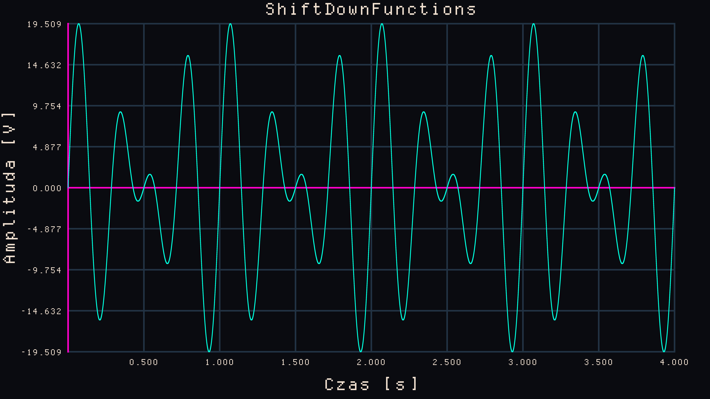

# ShiftDownFunctions

**ShiftDownFunctions** is a *Header-Only* C++ (or you may call it C with classes) function graph renderer for signals, math and whatever you will bend it to do.
It does not require any additional libraries, also it should work with Windows, it has been written on Linux Fedora 43 so no issues there.
## Functionality

- **Header-Only:** Just place the `.hpp` and it should work, you can try adding this lines into your `CMakeLists.txt` after the `add_executable(...)` for automatic fetch:

  ```cmake
  include(FetchContent)
  FetchContent_Declare(ShiftDownFunctions GIT_REPOSITORY https://github.com/DeadDeth/ShiftDownFunctions.git GIT_TAG main)
  FetchContent_MakeAvailable(ShiftDownFunctions)
  # Replace 'YourProgramName' with the target from your add_executable()
  target_link_libraries(YourProgramName PRIVATE ShiftDownFunctions)

- **2D Render Engine:** it generates 8k pictures in .bmp/.png formats, read the instructions inside the file.
- **Own Font:** It has built in its own font, so no need for any`.ttf`, all tho simple and strange, it iz what it iz, at least it works :).
- **AM, FM & PM:** Prepared by me, modulating functions for AM, FM and PM signals, in rectangle, triangle, sinusoidal and saw shapes.
- **DFT:** Spectrum rendering with DFT implementation.
- **Customizable:** Not by much, but you can manipulate the colors of the graph segments, also you can choose your saving directory quiet easily.

## Requirements

On RAM one picture is about 130MB of space, in order to convert it to .png automatically u need:
- **Windows:** Nothing somehow just a PowerShell script included by me works,
- **Linux:** Either **ImageMagick** (commands `magick` / `convert`) or **FFmpeg** (`ffmpeg`) added to PATH,

## Commands for linux users 

- **Fedora 43 and similar:** 
  - sudo dnf install ImageMagick ffmpeg
- **For Ubuntu / Debian / Pop!_OS:** 
  - sudo apt update
  - sudo apt install imagemagick ffmpeg
- **For Arch Linux / Manjaro:** 
  - sudo pacman -S imagemagick ffmpeg

## DEMO (96 kHz / 8K)



This plot demonstrates the real-time auto-ranging and sub-pixel precision of the custom rendering pipeline, free from any external graphical dependencies. It shows the **beat interference** of two closely spaced sinusoidal waves ($3\text{ Hz}$ and $4\text{ Hz}$) sampled at a studio-grade **96 kHz** over a 4-second window.

### 🛠️ Technical Insights:
- **True Physics Over Naive Math:** A simple addition of two $10\text{V}$ waves might naively suggest a clean $20\text{V}$ peak. However, since the phase peaks of $3\text{Hz}$ and $4\text{Hz}$ never perfectly align in time, the internal scanning loop discovered the absolute mathematical maximum at exactly **$19.509\text{V}$**.
- **Flawless Auto-Scaling:** The engine successfully mapped the resulting $39.018\text{V}$ peak-to-peak arena into 8 perfectly proportional grid steps of **$4.877\text{V}$**, proving the deterministic precision of the float-to-char converter under a heavy load of $384,000$ points drawn via a customized Bresenham's algorithm.

#### Created by DeadDeth. Licensed under the MIT License.
